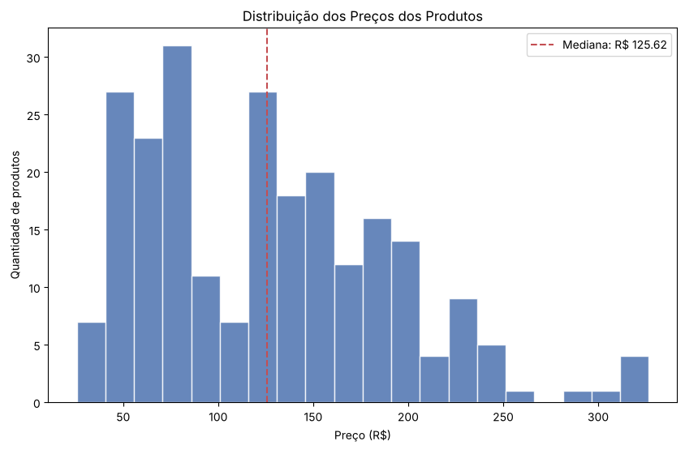
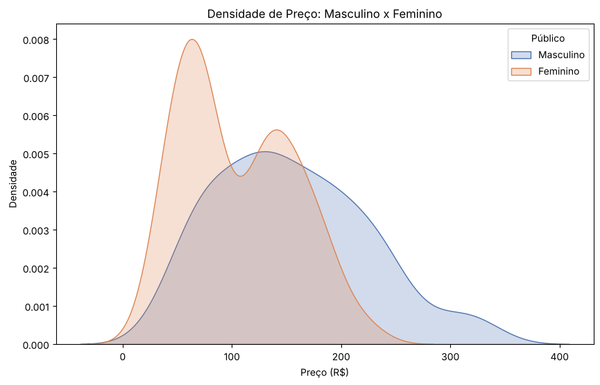
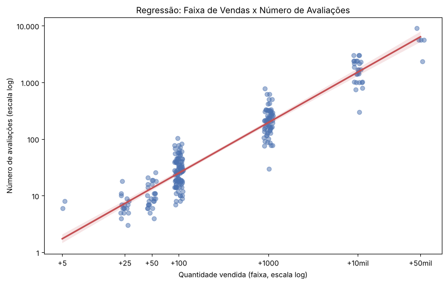

# Análise de E-commerce de Roupas

Análise exploratória e visualização de dados de 238 produtos de roupa vendidos online, feita em Python com pandas, matplotlib e seaborn. O objetivo foi entender como preço, nota, desconto, avaliações e vendas se relacionam, e o que diferencia os produtos por público e por marca.

Projeto desenvolvido no curso de Análise de Dados da EBAC.

O notebook completo, com código e leitura de cada gráfico, está em [`notebooks/analise_ecommerce.ipynb`](notebooks/analise_ecommerce.ipynb).

## Dashboard interativo

Também transformei os gráficos numa aplicação Dash com filtro por público, para quem quiser explorar os dados sem abrir o Python. Código e instruções na pasta [`dashboard/`](dashboard/).

## Perguntas de negócio

1. Como os preços estão distribuídos?
2. Produto mais caro recebe nota melhor?
3. Quais variáveis numéricas andam juntas?
4. Quais marcas concentram produtos e avaliações?
5. Para qual público são os produtos?
6. Roupa masculina e feminina ficam em faixas de preço diferentes?
7. Quem vende mais também recebe mais avaliações?

## Principais resultados

**Os preços se dividem em dois grupos.** Um entre R\$ 40 e R\$ 90 e outro entre R\$ 120 e R\$ 200. 89% dos produtos custam até R\$ 200.



**A roupa feminina é mais barata.** Mediana de R\$ 80 contra R\$ 149 na masculina. Na faixa de R\$ 40 a R\$ 90, 52% dos produtos são femininos, o que explica boa parte do grupo mais barato do histograma.



**Vendas e avaliações andam juntas.** Correlação de 0,90 nos valores originais e 0,95 em escala log. Como a base só informa a quantidade vendida em faixas (+100, +1000...), o número de avaliações funciona como um bom indicador de volume de vendas.



**Outros pontos:**

- A nota não tem relação com o preço (r = 0,07). 95% dos produtos têm nota 4 ou mais, e as notas mais baixas vêm de produtos com poucas avaliações.
- Preço, desconto e nota têm correlação fraca entre si (de 0,07 a 0,19).
- Lupo e Zorba concentram 52% de todas as avaliações. A Zorba tem só 8 produtos na base, todos kits de cueca.
- 84% dos produtos são roupa adulta, divididos de forma equilibrada entre masculino (43%) e feminino (41%).

## Tratamento dos dados

- Remoção de 57 linhas duplicadas (mesmo anúncio coletado mais de uma vez): de 295 para 238 produtos.
- Unificação de marcas escritas de formas diferentes ("stillger" e "stillger jeans").
- Agrupamento das 9 categorias de gênero em 4 públicos: Masculino, Feminino, Infantil e Sem gênero / Unissex.
- Colunas categóricas codificadas (`Marca_Cod`, `Material_Cod`, `Temporada_Cod`) ficaram fora da correlação, porque a ordem dos códigos não tem significado numérico.
- Escala logarítmica na regressão, já que vendas e avaliações vão de 5 a 50 mil.

## Ferramentas

- Python 3
- pandas e NumPy
- matplotlib e seaborn
- Plotly e Dash (dashboard interativo)
- Jupyter Notebook

## Estrutura do projeto

```
analise-ecommerce-roupas/
├── dados/
│   └── ecommerce_estatistica.csv
├── dashboard/
│   ├── app.py
│   ├── requirements.txt
│   └── README.md
├── imagens/
│   └── gráficos exportados do notebook
├── notebooks/
│   └── analise_ecommerce.ipynb
├── requirements.txt
└── README.md
```

## Como executar

Notebook:

```bash
git clone https://github.com/victorjmgarcia/analise-ecommerce-roupas.git
cd analise-ecommerce-roupas
pip install -r requirements.txt
jupyter notebook notebooks/analise_ecommerce.ipynb
```

Dashboard:

```bash
cd dashboard
pip install -r requirements.txt
python app.py
```

Depois é só abrir http://127.0.0.1:8050 no navegador.

## Próximos passos

- Extrair o tipo de produto do título (cueca, jeans, legging, short...) e testar se ele explica melhor a diferença de preço entre masculino e feminino.
- Analisar o texto das reviews para identificar as reclamações mais comuns.

## Autor

Victor
[LinkedIn](https://www.linkedin.com/in/victorjmgarcia)
